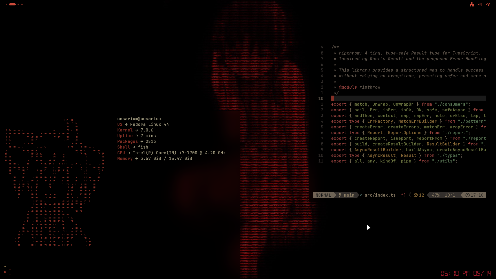

# dotfiles



- DE: Gnome 50
  - Extensions: `blur my shell`, `desktop widgets (desktop clock)`, `just perfection`, `user themes`, `alphabetical app grid` (cuz the default grid is actually good)
  - [Wallpaper](./assets/wallpaper.jpg)
  - Themes:
    - [A modified version of Gruvbox](./themes/)
    - Mouse: Bibata Modern Ice
    - Icons: Zafiro Icons
    - Fonts used: `Inter` (for UI), `JetBrainsMono Nerd Font` (for coding), `digital-7` (for clock widget)
- Shell: Fish + Starship
- Terminal: Kitty
- Editor: NeoVim - LazyVim
  - Theme: Gruvbox (edited with black background & red as primary color)

## system overrides

- ls: I prefer to use `lsd`
- rg: `ripgrep` > `grep`
- fd: `fd` > `find`
- cpd: `alias = wl-copy`
- [`zipcrawl`](https://github.com/SirCesarium/zipcrawl): my own tool for inspecting zip files without extracting them
- [`type-forge`](https://github.com/SirCesarium/type-forge): my own tool for generating structs/interfaces

## gnome settings

I didn't change too much stuff here, I just disabled almost anything I don't want with `just perfection` and applied blur to `kitty` with `blur my shell`.

## installation

- Make sure you have `gnome 50` installed.

- Install `gnome-tweaks` & `gnome-extensions` and then `blur my shell`, `desktop widgets (desktop clock)`, `just perfection`, `user themes`, `alphabetical app grid`.

- Extract the themes in `~/.themes`

```bash
cp -r ./themes/* ~/.themes/
```

- Copy some files inside `./config` into `~/.config` to use them, make sure you have a backup of your files before copy them
